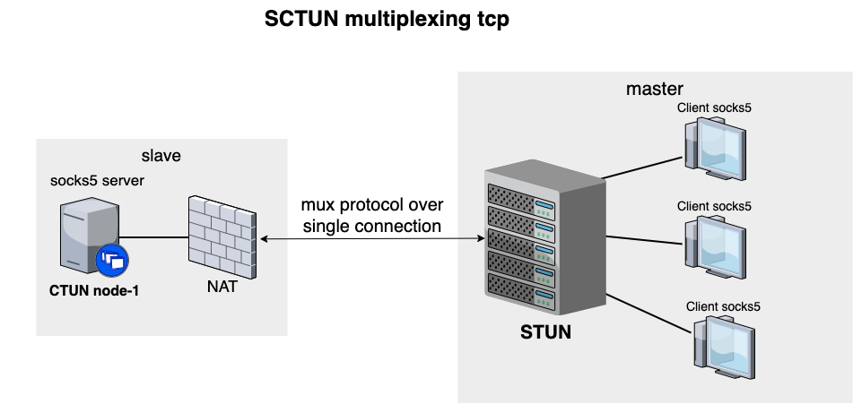

# SCTUN
## multiplexing socks5 back-connect proxy

**how it works, short diagram**


mux protocol schema

````text                                  
                             Byte array                                                                  

        |     0    |     1     |    2 3 4 5    |   6 7 8 9    |
        +-+-+-+-+-+-+-+-+-+-+-+-+-+-+-+-+-+-+-+-+-+-+-+-+-+-+-+
        |  version |  command  |  data length  |  session id  |
        +-+-+-+-+-+-+-+-+-+-+-+-+-+-+-+-+-+-+-+-+-+-+-+-+-+-+-+

        |<--------------------------------------------------->|
                            header size 10
````
build use Makefile
````bash
make linux
make win
make darwin
````

**stun** _(server-tunnel)_ - this is master hub server for connecting one-client to many-clients
````bash
~ $ stun -help

    Usage of stun:
      -addr string
            -addr <ip_addr> (default "0.0.0.0:8080")
       it`s tcp listener address for master node.       

      -external string
            -external <ip_addr> (default "127.0.0.1")
       your server public external ip address

      -http string
            -http <ip_addr> (default "0.0.0.0:8181")
       it`s http listener address for an active clients list
````

**ctun** _(client-tunnel)_ - this is slave node client to forward all requests from many another clients
````bash
~ $ ctun -help

    Usage of stun:
      -master string
            --master <ip_master_server> (default "127.0.0.1:8080")
       it`s address of stun master server  
````


example 
````bash
#start master stun server
./stun --addr 0.0.0.0:8080 -external you_public_ip -http 127.0.0.1:8081

#start slave ctun client on another server
./ctun --master you_public_ip:8080
````

how to use. 
After success connect client(ctun) to server(stun).
You may go to http `http://you_public_ip:8081` and getting active ctun clients list,
use they for your socks5 client


Example curl
````bash
curl --socks5 you_public_ip:10001 check-host.net/ip
````


for socks5 server i use code https://github.com/armon/go-socks5

# License:

[MIT](LICENSE)